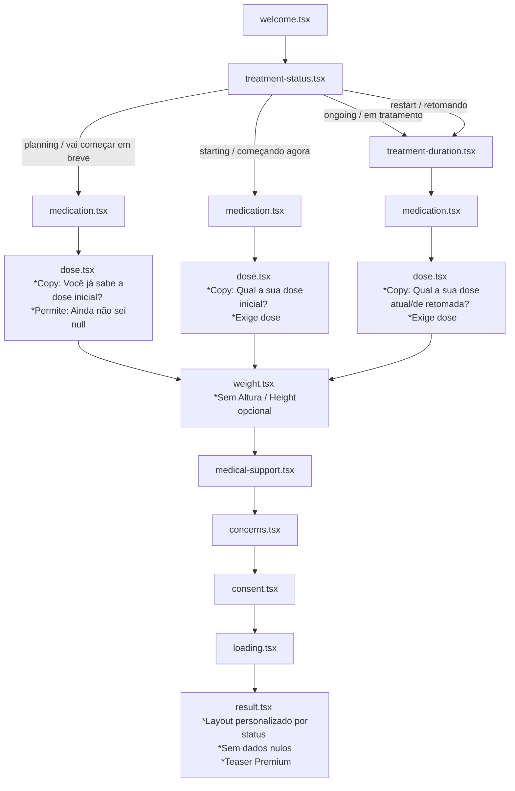

# Plano de Implementação — Redesenho Lógico do Onboarding por Status (Finalizado)

Este plano descreve o redesenho da árvore de decisão do onboarding do DoseDay V5 com base no status do tratamento (`treatment_status`). Ele centraliza a navegação, remove atritos desnecessários (como altura), torna a dose condicional para pacientes em planejamento (`planning`), e melhora a tela de resultados por branch com uma provocação Premium suave.

---

## Decisões & Ajustes Aprovados

> [!IMPORTANT]
> **Preservação do Auto-Set da Duração (Crítico):** 
> A gravação automática do valor de `treatment_duration` ao pular a tela (`null` para `planning`, `'<1m'` para `starting`) continuará ocorrendo via `submitStep` na tela de status do tratamento (`treatment-status.tsx`). O helper de navegação centralizado apenas cuidará das rotas, enquanto as mutações do estado e gravação de banco correspondentes a pular a tela de duração continuarão sendo invocadas no `onSubmit` da tela de status.

> [!IMPORTANT]
> **Helpers de Navegação:**
> As funções `getValidOnboardingSteps`, `getNextOnboardingStep` e `getPreviousOnboardingStep` serão implementadas diretamente em [onboarding.ts](file:///Users/leofrancaia/Desktop/dose-day-v5/lib/types/onboarding.ts) (onde o array global `ONBOARDING_STEPS` já está localizado), evitando a mistura de navegação com esquemas de validação do Zod.

> [!IMPORTANT]
> **Consentimento LGPD:**
> Seguiremos com a **Opção A** (manter a tela de consentimento dedicada no onboarding com copy leve e visual mais integrado). Não alteraremos nada nas telas de signup ou auth.

---

## Diagnóstico Técnico por Tela

| Tela | Estado Atual | Redesenho Proposto |
|---|---|---|
| **`treatment-status.tsx`** | Transições hardcoded inline duplicadas e inconsistentes. | Chama `submitStep` (incluindo o auto-set da duração se aplicável) e delega a navegação ao helper de passo válido baseado no status. |
| **`treatment-duration.tsx`** | Exibida para todos os usuários com histórico ou não. | Pulada automaticamente para os ramos `planning` (vai começar) e `starting` (começando agora). |
| **`medication.tsx`** | Ao voltar, tenta fazer roteamento condicional hardcoded. | Usa o helper centralizado `getPreviousOnboardingStep` passando o status atual. |
| **`dose.tsx`** | Validação exige dose positiva > 0; copy rígida; lembrete de intervalo escondido. | Usa schema local dinâmico: se `planning`, aceita `current_dose = null` ("Ainda não sei"). Adapta a copy (headline/subtitle) ao status. Torna o input customizado visível e intuitivo. |
| **`weight.tsx`** | Exige altura (`height`), que não é usada para cálculos ou IA. | Campo de altura (`height`) removido inteiramente da tela. Schema torna o campo opcional para compatibilidade. |
| **`loading.tsx`** | Animação de bola pulsante amadora. | Proposta de indicador clínico refinado (progress bar ou checklist ativo elegante) respeitando `reducedMotion`. |
| **`result.tsx`** | Cards soltos de fallback. IA misturada. | Organizado em 4 layouts estruturados por branch de status. Omitirá linhas de dados que não foram fornecidos (dose/frequência). Inclui teaser Premium com CTA suave de conversão no rodapé. |

---

## Árvore Lógica Proposta (Branches por Status)

Mapeada com base nas opções de `TREATMENT_STATUS_OPTIONS`:



---

## Helpers Centralizados em `lib/types/onboarding.ts`

```typescript
// Retorna a lista de passos aplicáveis de acordo com o status
export function getValidOnboardingSteps(status?: TreatmentStatus): OnboardingStep[] {
  const steps: OnboardingStep[] = ['welcome', 'treatment-status']
  if (status && status !== 'planning' && status !== 'starting') {
    steps.push('treatment-duration')
  }
  steps.push('medication', 'dose', 'weight', 'medical-support', 'concerns', 'consent', 'loading', 'result')
  return steps
}

// Avança para o próximo passo válido
export function getNextOnboardingStep(step: OnboardingStep, status?: TreatmentStatus): OnboardingStep {
  const steps = getValidOnboardingSteps(status)
  const idx = steps.indexOf(step)
  if (idx === -1) return 'welcome'
  return steps[Math.min(idx + 1, steps.length - 1)]
}

// Retorna para o passo anterior válido
export function getPreviousOnboardingStep(step: OnboardingStep, status?: TreatmentStatus): OnboardingStep {
  const steps = getValidOnboardingSteps(status)
  const idx = steps.indexOf(step)
  if (idx === -1) return 'welcome'
  return steps[Math.max(idx - 1, 0)]
}
```

---

## Contratos da Tela Final (`result.tsx`)

A tela de resultados exibirá o título e subtítulo correspondentes a cada branch de tratamento, omitindo qualquer campo não preenchido:

1.  **`planning`**: *"Sua preparação está pronta"*. 
    *   Exibe peso atual, meta e profissional de saúde.
    *   **Critério Absoluto:** Omitirá linhas de dose, frequência ou próxima dose se não fornecidas. Sem insights de IA fictícios.
    *   *Conteúdo:* Card informativo explicando que o DoseDay está preparado para registrar a primeira aplicação, monitorar pesos e preparar a primeira consulta.
2.  **`starting`**: *"Sua primeira semana está organizada"*.
    *   Exibe medicação, dose inicial e peso inicial/meta.
3.  **`ongoing`**: *"Sua memória de tratamento está pronta"*.
    *   Exibe resumo com dose atual, frequência de lembretes e peso atual.
4.  **`restart`**: *"Sua retomada está organizada"*.
    *   Exibe a medicação e dose de retomada.

---

## Reflexão de Dados no Dashboard

Garantiremos que os dados coletados no onboarding apareçam imediatamente na Home (`HomeV7Content.tsx`):
1.  **Medicação / Dose:**
    Se o usuário não tem histórico real de aplicações (`hasDoseHistory = false`), o `NextDoseHero` utilizará os dados do perfil:
    *   Se possui medicação e dose: *"Prepare-se para aplicar sua primeira dose de [Ozempic] [0.25]mg."*
    *   Se possui apenas medicação (planning sem dose): *"Prepare-se para aplicar sua primeira dose de [Ozempic]."*
    *   Se nenhum: mantém a mensagem padrão.
2.  **Peso / Meta:**
    *   O `WeightCard` da Home exibirá o peso atual (`profile.currentWeight` ou `weightLogs[0]`) e o peso inicial.
    *   O delta de peso em relação ao peso inicial será calculado instantaneamente.
    *   Exibiremos a meta de peso no subtítulo do card de Peso (si definida no perfil): *"Meta: [70] kg"*.
3.  **Preocupações (Foco):**
    *   Se o usuário selecionou sintomas de foco no onboarding (ex: `nausea`, `side_effects`), priorizaremos sugestões correspondentes em dicas ou cards na Home (futuramente) e na timeline da memória recente.
---

## Arquivos que Mudam

### ⚙️ Core & Schemas
*   [MODIFY] [onboarding.ts](file:///Users/leofrancaia/Desktop/dose-day-v5/lib/types/onboarding.ts): 
    *   Atualizar `height` para opcional (`height?: number | null`).
    *   Adicionar funções centralizadas `getValidOnboardingSteps`, `getNextOnboardingStep` e `getPreviousOnboardingStep` com o status do tratamento.
*   [MODIFY] [onboardingSchemas.ts](file:///Users/leofrancaia/Desktop/dose-day-v5/lib/validation/onboardingSchemas.ts):
    *   Tornar `height` opcional em `weightWithGoalSchema`.
    *   Remover do Zod as funções antigas `getNextOnboardingStep` e `getPreviousOnboardingStep` para evitar colisão e duplicidade.
*   [MODIFY] [OnboardingContext.tsx](file:///Users/leofrancaia/Desktop/dose-day-v5/contexts/OnboardingContext.tsx):
    *   Ajustar `inferCompletedSteps` para concluir peso sem altura, e dose com `null` (planning).
    *   Integrar o parâmetro `status` nas funções de avanço/retorno de passos.

### 📱 Telas do Onboarding
*   [MODIFY] [treatment-status.tsx](file:///Users/leofrancaia/Desktop/dose-day-v5/app/(onboarding)/treatment-status.tsx):
    *   Submeter `treatment-status` e executar o auto-set da duração (`null` para planning, `'<1m'` para starting) via `submitStep` subsequente, antes de navegar com o helper dinâmico.
*   [MODIFY] [treatment-duration.tsx](file:///Users/leofrancaia/Desktop/dose-day-v5/app/(onboarding)/treatment-duration.tsx): Adaptar navegação reversa e envio via helper com status.
*   [MODIFY] [medication.tsx](file:///Users/leofrancaia/Desktop/dose-day-v5/app/(onboarding)/medication.tsx): Atualizar `handleBack` para ler o helper centralizado.
*   [MODIFY] [dose.tsx](file:///Users/leofrancaia/Desktop/dose-day-v5/app/(onboarding)/dose.tsx):
    *   Headline e subtitle dinâmicos por status.
    *   Uso de schema local condicional para opcionalidade de dose no status `planning`.
    *   Exibir campo de frequência customizado de forma óbvia.
*   [MODIFY] [weight.tsx](file:///Users/leofrancaia/Desktop/dose-day-v5/app/(onboarding)/weight.tsx): Remover input visual de altura (`height`), e atualizar o envio de dados.
*   [MODIFY] [loading.tsx](file:///Users/leofrancaia/Desktop/dose-day-v5/app/(onboarding)/loading.tsx): Substituir o `PulseAnimation` (bola pulsante) por barra de progresso clínico/checklist refinado (Fase 2).
*   [MODIFY] [result.tsx](file:///Users/leofrancaia/Desktop/dose-day-v5/app/(onboarding)/result.tsx): Refatorar fallbacks e layouts específicos por branch de status, omitir dados nulos e adicionar teaser Premium (Fase 2).

### 🏠 Dashboard & Locale
*   [MODIFY] [HomeV7Content.tsx](file:///Users/leofrancaia/Desktop/dose-day-v5/components/home/HomeV7Content.tsx): Personalizar texto vazio do `NextDoseHero` com dados da medicação do onboarding se não houver doses registradas. Mostrar meta de peso no `WeightCard`.
*   [MODIFY] [onboarding.json](file:///Users/leofrancaia/Desktop/dose-day-v5/locales/pt-BR/onboarding.json):
    *   Ajustar `"doseRange"` para max 20 mg.
    *   Adicionar chaves de copy para headlines de dose por status e layouts do `result` por branch.

---

## Plano de Implementação em 2 Fases

### Fase 1: Árvore Lógica, Opcionalidade de Dose/Altura e Navegação (Release Blocker)
1.  **Ajuste de Schemas e Tipos:** Atualizar `onboarding.ts` (remover altura, adicionar helpers de navegação) e `onboardingSchemas.ts` (remover helpers antigos, atualizar Zod).
2.  **Refatoração do Contexto:** Ajustar `OnboardingContext.tsx` com `inferCompletedSteps` atualizado e integração de status nas transições.
3.  **Telas de Navegação:** Ajustar `treatment-status.tsx` (preservando auto-set de duração), `treatment-duration.tsx`, `medication.tsx` e `weight.tsx` (remover input de altura).
4.  **Tela de Dose:** Implementar a copy condicional por status, o botão "Ainda não sei" que salva `current_dose = null`, e visualização desobstruída do input de intervalo customizado.
5.  **Tela Final (Result):** Implementar os fallbacks de layout por branch de status, ocultando dados nulos.
6.  **Dashboard:** Integrar a exibição da medicação e meta do onboarding no `HomeV7Content.tsx` caso não haja histórico de doses.
7.  **Parar para Validação (Fase 1):** Realizar screenshots das 4 jornadas + retomada + reflexo no Dashboard e submeter para OK do Léo.

### Fase 2: Polish Visual e Conversão (Polish)
1.  **Loading Animado Premium:** Criar a barra de progresso/checklist refinada em `loading.tsx` respeitando `reducedMotion`.
2.  **Teaser Premium na Tela Final:** Adicionar a seção de conversão Premium no rodapé de `result.tsx` com CTA suave.
3.  **Auditoria Geral e Testes:** Executar testes manuais no simulador cobrindo as 4 ramificações (`planning`, `starting`, `ongoing`, `restart`) e validar a retomada (`inferCompletedSteps`) de fluxos inacabados.
